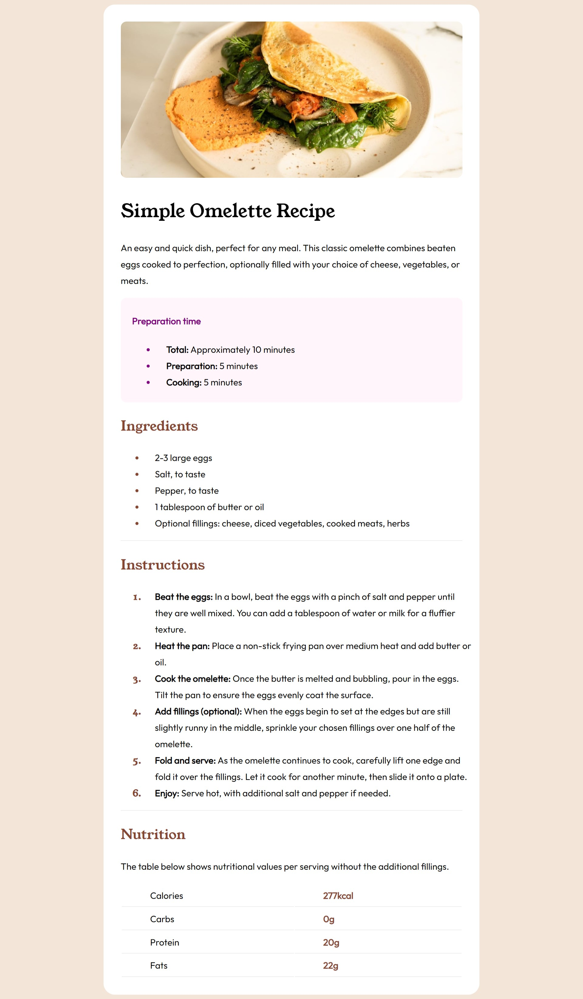

# Frontend Mentor - Recipe page solution

This is a solution to the [Recipe page challenge on Frontend Mentor](https://www.frontendmentor.io/challenges/recipe-page-KiTsR8QQKm). Frontend Mentor challenges help you improve your coding skills by building realistic projects. 

### Screenshot

### Links

- Live Site URL: [Click me go to the website](https://zhihao2808.github.io/Recipe_practice/)

### Built with

- Semantic HTML5 markup
- CSS custom properties

## Author

- Website - [zhihao2808](https://www.your-site.com)
